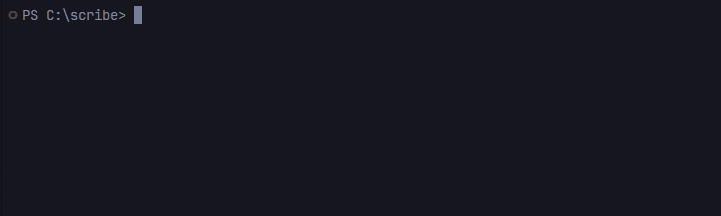
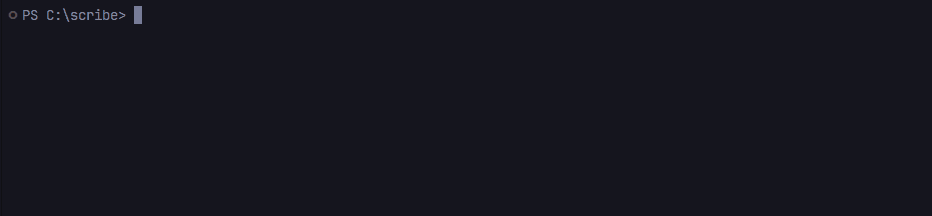

# ✍️ Scribe

> AI-powered Git Commit Assistant that generates clean, meaningful commit messages from your staged changes using LLMs.

Generate meaningful Git commit messages instantly from your staged changes using OpenAI, Claude, Gemini, or Ollama.

<p align="center">
  
</p>

[](https://go.dev/)
[](LICENSE)

---

## 📚 Table of Contents

- [✨ Features](#-features)
- [📦 Installation](#-installation)
- [🚀 Quick Start](#-quick-start)
- [⚙️ Configuration](#️-configuration)
- [📖 Usage](#-usage)
- [🔗 Git Hook Integration](#-git-hook-integration)
- [⚡ Performance & Caching](#-performance--caching)
- [🛠️ Project Structure](#️-project-structure)
- [⭐ Support](#-support)
- [📄 License](#-license)

---

## ✨ Features

- 🤖 **Multi-Provider Support:** OpenAI, Anthropic Claude, Google Gemini, and Ollama.
- 💬 **Interactive CLI:** Built with Cobra and Survey.
- 🏷️ **Context Awareness:** Detects ticket IDs from branch names.
- ⚡ **SHA-256 Caching:** Reuses responses for identical staged diffs.
- 🧩 **Large Diff Handling:** Chunking and summarization for large changes.
- 🔗 **Git Hook Support:** Works as both a CLI and `pre-commit` hook.

### 💡 At a Glance

| Capability         | Details                                            |
| ------------------ | -------------------------------------------------- |
| 🤖 AI Providers    | OpenAI, Claude, Gemini, Ollama                     |
| ⚡ Performance     | SHA-256 caching for identical staged diffs         |
| 🏷️ Context         | Automatically detects ticket IDs from branch names |
| 🧩 Large Changes   | Chunking and summarization for large diffs         |
| 🪝 Git Integration | CLI and `pre-commit` hook support                  |

---

## 📦 Installation

### Option 1: Pre-compiled Binaries (Recommended)

Download the latest pre-compiled binaries for Windows, macOS, and Linux from the [Releases page](https://github.com/alan-shabrandi/scribe/releases/latest).

For macOS / Linux:

```bash
tar -xzf scribe_*_linux_amd64.tar.gz
sudo mv scribe /usr/local/bin/
```

For Windows:

Extract the `.zip` file and add the folder containing `scribe.exe` to your system's Environment Variables (`PATH`).

### Option 2: Using Go Install (For Go Developers)

If you have Go 1.21+ installed, this is the easiest way:

```bash
go install https://github.com/alan-shabrandi/scribe/cmd/scribe@latest
```

### Option 3: Build from Source

#### Prerequisites

- Go 1.21+
- Git

```bash
git clone https://github.com/alan-shabrandi/scribe.git
cd scribe
go build -o scribe ./cmd/scribe
```

---

## 🚀 Quick Start

Once Scribe is installed, configure your provider and generate your first commit message:

```bash
scribe config set provider openai
scribe config set api_key YOUR_API_KEY

git add .
scribe generate
```

That's it — Scribe analyzes your staged changes and generates clean commit message candidates for you to choose from.

> **Need more configuration options?** See the [Configuration](#️-configuration) section below.

---

## ⚙️ Configuration

Scribe stores its configuration in:

```text
~/.scribe.yaml
```

| Setting    | Description                                   | Example        |
| ---------- | --------------------------------------------- | -------------- |
| `provider` | LLM provider used to generate commit messages | `openai`       |
| `model`    | Model used by the selected provider           | `gpt-4o`       |
| `style`    | Commit message style                          | `conventional` |
| `api_key`  | API key for the selected provider             | `your-api-key` |

Configure Scribe using:

```bash
scribe config set provider openai
scribe config set api_key "your-api-key"
scribe config set model "gpt-4o"
scribe config set style "conventional"
```

---

## 📖 Usage

### 1. Stage Your Changes

```bash
git add .
```

### 2. Generate Commit Messages

```bash
scribe generate
```

### 3. Choose a Commit Message

Scribe analyzes your staged changes and presents multiple candidates:

```text
🔍 Fetching staged git changes...
📌 Detected Context: Branch 'feature/PROJ-892-add-cache'
✔ Generating candidate commit messages via 'openai'...

? Select a commit message option:

▸ feat(cache): add SHA-256 caching for staged diffs (PROJ-892)
  perf(diff): skip LLM invocation on identical git diff (PROJ-892)
  ✏️ Edit custom message in system editor
  🚫 Cancel
```

---

## 🔗 Git Hook Integration

Integrate Scribe directly into your native Git workflow. Once installed, simply run `git commit` as usual and let Scribe generate candidates for you automatically.

<p align="center">
  
</p>

```bash
scribe hook install
```

To remove the hook:

```bash
scribe hook uninstall
```

This lets Scribe integrate into your commit workflow without requiring you to manually run the generation command every time.

---

## ⚡ Performance & Caching

Scribe uses SHA-256 caching to avoid repeated LLM requests for identical staged diffs.

Cached responses are stored in:

```text
~/.scribe_cache.json
```

This helps reduce unnecessary LLM calls and makes repeated commit message generation faster.

---

## 🛠️ Project Structure

```text
scribe/
├── cmd/
│   └── scribe/
├── internal/
│   ├── cache/
│   ├── config/
│   ├── git/
│   └── llm/
├── go.mod
└── README.md
```

---

## ⭐ Support

If you find Scribe useful, consider giving the repository a ⭐ on GitHub.

---

## 📄 License

Licensed under the MIT License.

See `LICENSE` for details.
